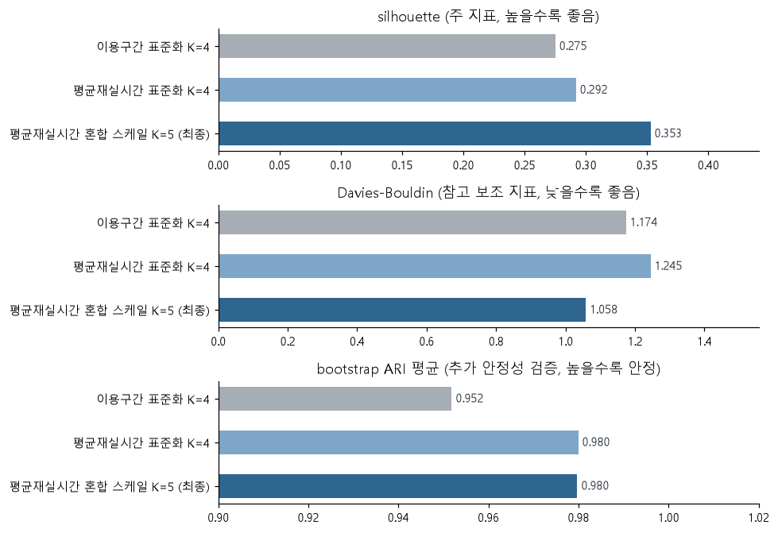
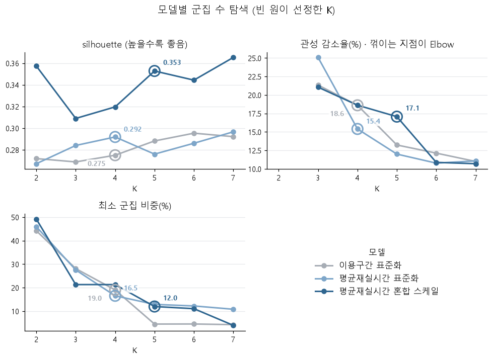
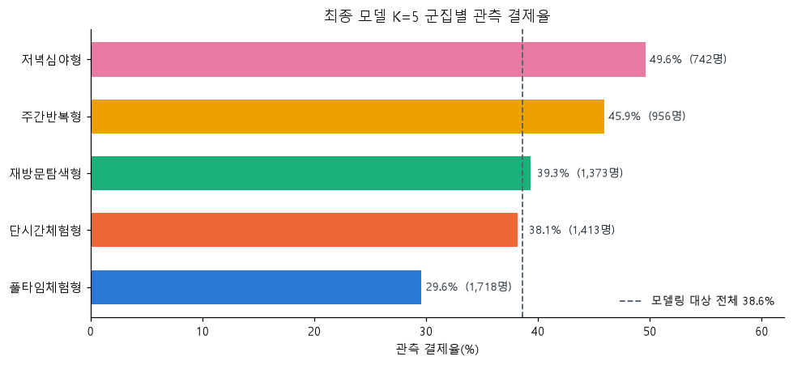
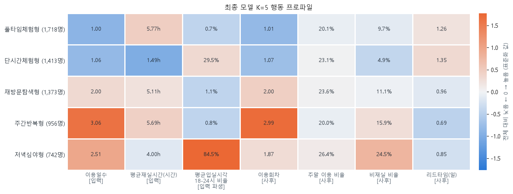

# 공유오피스 무료체험 고객 행동 군집화

**무료체험 고객 6,202명의 이용 행동을 KMeans로 5개 유형으로 구분하고, 군집별 관측 결제율과 운영 개선안을 정리한 프로젝트입니다.**

코드잇 스프린트 DA16 · PART3 중급2 · 포카드(4인 팀) · 2026.09.11–2026.09.29

| 한눈에 보는 결과 | 내용 |
|---|---|
| 최종 설계 | KMeans K=5 · 이용일수 StandardScaler, 재실시간·입실시각 RobustScaler |
| 분리도·안정성 | silhouette 0.353 · bootstrap ARI 평균 0.980, 최저 0.955 |
| 관측 결제율 상위 유형 | 저녁심야형 49.6% · 주간반복형 45.9% |
| 모델링 대상 평균 | 38.6%(2,394 / 6,202명) |

결제 여부는 군집 생성과 군집 수·모델 선정에 사용하지 않고, 군집을 확정한 뒤 사후 비교에만 사용했습니다. 이 분석은 행동 유형을 발견하는 비지도학습 프로젝트이며 결제 예측 성능이나 전환 개선 효과를 입증한 실험은 아닙니다.

[분석 노트북](notebooks/trial_customer_clustering.ipynb) · [최종 보고서](docs/final_report.pdf) · [발표 자료](docs/presentation.pdf) · [실행 안내](notebooks/README.md)

## 프로젝트 개요와 문제 정의

3일 무료체험 방문 고객의 결제율만으로는 어떤 이용 맥락에서 전환이 관찰되는지 알기 어렵습니다. 오래 머문 고객, 여러 날 방문한 고객, 저녁에 이용한 고객을 구분해 행동 유형별 후속 안내의 근거를 마련하고자 했습니다.

핵심 질문은 **“이용 행동으로 군집화했을 때 어떤 고객 유형이 도출되며, 유형별 관측 결제율은 어떻게 다른가?”**입니다. 이용일수·실제 재실시간·입실시각을 함께 분석하고, 기록의 자정 분할이 재방문 해석을 왜곡하는지도 확인했습니다.

## 데이터와 분석 대상

| 입력 | 역할 |
|---|---|
| trial_register | 체험 신청일 |
| trial_visit_info | 날짜·지점별 방문, 첫 입실·마지막 퇴실 시각, 재실초 |
| trial_access_log | 출입 사건과 기록 관측 범위 확인 |
| trial_payment | 결제 여부, 군집 확정 후 결과 비교 |

교육 과정 프로젝트에 사용된 공유오피스 데이터입니다. 신청 기록은 2021-05-01부터 2023-12-31까지이며 체험 기간에 따른 방문 기록은 2024-01-02까지 이어집니다.

| 대상 선정 | 고객 수 | 관측 결제 고객 |
|---|---:|---:|
| 체험 신청 | 9,624 | — |
| 방문 기록 있음 | 6,534 | 2,564(39.2%) |
| 입·퇴실 시각이 최소 1일 관측됨: EDA | 6,207 | 2,399(38.6%) |
| 모든 이용일 시각이 관측됨: 모델링 | 6,202 | 2,394(38.6%) |

제공된 원본 CSV 4개로 전체 실행을 검증했습니다. 개인 출입·결제 기록과 재배포 범위를 고려해 원본을 공개하는 대신 [필수 파일·열 정의](data/README.md)와 [원본 명세서](docs/data_dictionary.xlsx)를 제공합니다. `site_area.csv`는 본 분석에서 사용하지 않아 필수 입력이 아닙니다.

## 전처리

- 중복 행 제거: 신청 28행, 방문 48행, 출입 359행, 결제 35행. 출입은 구분·시각·지점·고객이 같은 사건을 중복으로 처리했습니다.
- 혼합 시각 형식 처리: `format="mixed"`로 기본 변환에서 결측으로 처리되던 유효 시각 792행을 보존했습니다. 출입 로그의 UTC 시각은 KST로 변환했습니다.
- 시각 결측: 방문 기록 555행은 입·퇴실 시각이 함께 비어 있어 대치하지 않았습니다. 모든 이용일 시각이 관측된 고객만 모델링했습니다.
- 고객–일 집계: 같은 날 여러 지점의 방문을 합쳐 최초 입실, 마지막 퇴실, 재실초 합계를 계산했습니다. 재실초가 입·퇴실 구간보다 크면 구간을 상한으로 뒀습니다.
- 자정 분할: 23:59:59 퇴실과 다음 날 00:00 입실 기록을 삭제하지 않고, 사후 이용회차 계산과 시간대 해석 검증에 사용했습니다.

## 파생변수

| 군집 입력 | 산출과 변환 |
|---|---|
| 이용일수 | 서로 다른 달력 날짜 수(1–4일) → StandardScaler |
| 평균재실시간 | 고객–일별 재실초를 시간으로 변환한 뒤 이용일 전체 평균 → log1p → RobustScaler |
| 평균입실시각 | 최초 입실을 sin·cos로 원형 평균 → 고객별 단위벡터 → RobustScaler → 각 열에 1/√2 가중 |

23시와 1시를 단순 평균하면 12시가 되는 문제를 피하기 위해 원형 시간을 사용했습니다. 세 행동축은 sin·cos 때문에 실제 입력에서는 네 열로 표현됩니다. 1/√2는 시간 두 열의 차원 수를 고려한 감쇠이며 정확한 분산 정규화는 아닙니다.

이용회차, 회차당 재실시간, 입실시각 일관성 R, 주말 이용 비율, 비재실 비율, 리드타임, 결제 여부는 **사후 해석 변수**로 구분했습니다. 달력 이용일수는 자정을 넘긴 한 번의 이용을 이틀로 셀 수 있어 독립된 방문 횟수와 다릅니다.

## 모델 비교와 선정

KMeans의 난수 42·초기 중심 시도 10회는 고정하고, 시간 변수 정의와 표현·스케일링이 다른 세 설계를 비교했습니다. 각 설계에서 K=2–7을 탐색해 분리도, 관성 감소율, 최소 군집 규모, 해석 가능성을 함께 판단했습니다. 선정 후 같은 변환 입력에서 고객을 복원추출해 20회 다시 적합하는 bootstrap 안정성을 확인했습니다.

| 설계 | 선정 K | silhouette | DBI | bootstrap ARI 평균 / 최저 | 최소 군집 비중 |
|---|---:|---:|---:|---:|---:|
| 이용구간 표준화 | 4 | 0.275 | 1.174 | 0.952 / 0.921 | 19.0% |
| 평균재실시간 표준화 | 4 | 0.292 | 1.245 | 0.980 / 0.938 | 16.5% |
| 평균재실시간 혼합 스케일 | **5** | **0.353** | **1.058** | **0.980 / 0.955** | **12.0%** |



최종 설계에서도 K=7의 silhouette(0.3653)는 K=5(0.3528)보다 높았습니다. 그러나 최소 군집이 245명(3.95%)으로 작아지고 유형 설명이 복잡해졌습니다. K=5는 최소 742명(11.96%)을 확보하면서 하루 단시간·장시간, 반복 방문, 저녁 이용을 구분하는 선택이었습니다. 따라서 K=5를 점수만으로 자동 결정된 최적값으로 해석하지 않습니다.



## 핵심 결과와 군집 해석

| 행동 유형 | 인원 | 평균 이용일수 | 평균 재실시간 | 대표 입실시각 | 평균 이용회차 | 관측 결제율 |
|---|---:|---:|---:|---:|---:|---:|
| 풀타임체험형 | 1,718 | 1.00일 | 5.77시간 | 12.6시 | 1.01회 | 29.6% |
| 단시간체험형 | 1,413 | 1.06일 | 1.49시간 | 16.2시 | 1.07회 | 38.1% |
| 재방문탐색형 | 1,373 | 2.00일 | 5.11시간 | 13.1시 | 2.00회 | 39.3% |
| 주간반복형 | 956 | 3.06일 | 5.69시간 | 12.8시 | 2.99회 | 45.9% |
| 저녁심야형 | 742 | 2.51일 | 4.00시간 | 21.0시 | 1.87회 | 49.6% |



높은 관측 결제율은 **저녁 시간대 이용**과 **주간의 실제 반복 방문**이라는 서로 다른 두 유형에서 나타났습니다. 반면 하루 장시간 이용하는 풀타임체험형은 결제율이 가장 낮아, 긴 체류 자체만으로 전환 차이를 설명하기 어려웠습니다.



저녁심야형의 평균 이용일수 2.51일은 평균 이용회차 1.87회보다 높았습니다. 자정을 넘긴 한 번의 이용이 날짜별로 분리되는 영향입니다. 자정 연속 기록을 제외해도 고객–일 최초 입실의 59.1%가 18–24시에 나타나 저녁 중심의 해석은 유지됐습니다. 이는 고객 대표 입실시각이 18–24시인 비율 84.5%와 분모가 다른 지표입니다.

입실시각 일관성 R을 평균벡터나 표본 가중치로 반영하는 민감도 분석에서도 기준 군집과 ARI 0.818·0.971로 대부분의 구조가 유지됐지만 분리도는 개선되지 않았습니다. R은 최종 입력이 아닌 사후 해석에 사용했습니다.

## 운영 제안

| 대상 | 제안 | 후속 검증 |
|---|---|---|
| 저녁심야형 | 적합한 저녁·심야 이용권이 있다면 체험 종료 후 안내. 새 상품은 수요와 운영 가능성 먼저 검토 | 발송군·비교군 결제율, 클릭률, 운영 비용 |
| 주간반복형 미결제 고객 | 체험 종료 무렵 가격·상품·이용 조건에 관한 미결제 사유 조사 후 안내 조정 | 설문 응답률, 장벽별 비중, 후속 안내 결제율·비용 |

개선안은 제안 단계입니다. 실제 A/B 테스트, 전환율 상승, 매출 증가는 검증하지 않았습니다.

## 본인 기여

**이창준 · 팀장 겸 프로젝트 리더** — 본인이 확인한 프로젝트 역할입니다. 보고서에는 포카드 팀의 공동 산출물로 김문진·이창준·최유리·황현정이 명시돼 있습니다. 개인별 코드 작성·분석 업무 범위는 별도로 확인되지 않아 구체적인 분석 작업을 개인 단독 성과로 기재하지 않았습니다.

## 한계와 후속 과제

- 군집별 결제율 차이는 관측된 연관성입니다. 결제 시점이 없어 행동과 결제의 시간적 선후도 확인할 수 없으며 특정 행동의 결제 유발 효과로 해석하지 않습니다.
- 결제금액·상품·재구매·방문 목적이 없어 매출·LTV나 고객 직업을 추정하지 않습니다. 군집 이름은 관측 행동을 요약한 명칭입니다.
- 자정 분할·로그 누락·시각 대표성의 오차가 남을 수 있습니다. 이용일수와 이용회차를 함께 봐야 합니다.
- KMeans 이외 알고리즘과 신규 고객 검증은 수행하지 않았습니다. 동일 표본의 bootstrap 안정성이 신규 고객 일반화를 보장하지 않습니다.
- 결과는 완전 관측 고객 6,202명에 한정됩니다. 미방문 3,090명과 시각이 일부라도 결측인 방문 고객 332명에 그대로 적용할 수 없습니다.
- 리드타임은 남은 체험 가능일수와 구조적으로 연결돼 관심도나 전환 의향의 직접 지표로 사용하지 않았습니다.
- 원본 CSV를 가진 환경에서 전체 실행을 검증했습니다. 공개 저장소에는 원본이 없어 실행하려면 권한이 있는 데이터 사본을 별도로 준비해야 합니다. 환경과 검증 결과는 [실행 검증 기록](docs/execution_validation.md)을 참고하세요.

## 저장소 구조와 검증 범위

```text
shared-office-trial-clustering/
├── README.md
├── requirements.txt
├── .gitignore
├── notebooks/
│   ├── trial_customer_clustering.ipynb
│   └── README.md
├── docs/
│   ├── final_report.pdf
│   ├── presentation.pdf
│   ├── data_dictionary.xlsx
│   └── execution_validation.md
├── images/
│   ├── model_comparison.png
│   ├── cluster_count_evaluation.png
│   ├── cluster_payment_rates.png
│   └── cluster_behavior_profile.png
└── data/README.md
```

보고서·발표 PDF·명세서는 원본을 그대로 보존했습니다. 공개 노트북은 입력 경로를 정리하고 제공된 원본 CSV로 전체 실행한 사본입니다. 군집 인원·주요 평가 지표·결제율이 기존 산출물과 일치하는지 확인했습니다. README 이미지 4개는 원본 노트북의 저장된 그래프를 보존했습니다. 실행 조건과 공개본 변경 사항은 [노트북 안내](notebooks/README.md)를 참고하세요.
